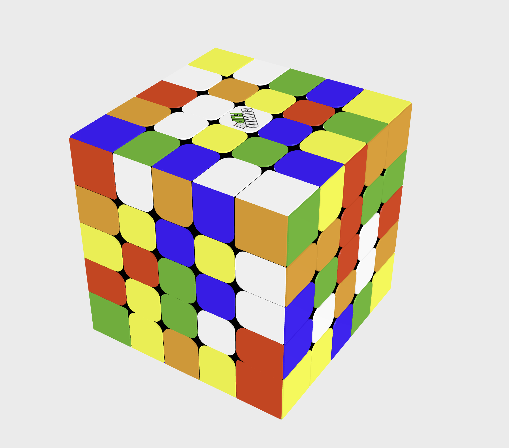

# Rubiks Cube Web Component

This package is a rubiks cube web component built with threejs. Camera animation smoothing is done with the gsap package.



## Adding the component

You can add the component to a webpage by adding an import statement in the index.js file. And then
by adding the webcomponent tag.

```js
//index.js
import '@houstonp/rubiks-cube';
```

```html
<!DOCTYPE html>
<html lang="en">
    <head>
        <meta charset="utf-8" />
    </head>
    <body>
        <rubiks-cube animation-speed-ms="1000" animation-style="exponential" piece-gap="1.04" camera-speed="100"> </rubiks-cube>
        <script type="module" src="index.js"></script>
    </body>
</html>
```

## component attributes

| attribute                    | accepted values                        | Description                                                                                                                                                   |
| ---------------------------- | -------------------------------------- | ------------------------------------------------------------------------------------------------------------------------------------------------------------- |
| animation-speed-ms           | integer greater than or equal to 0     | sets the duration of the animations in milliseconds                                                                                                           |
| animation-style              | "exponetial", "next", "fixed", "match" | fixed: fixed animation lengths, next: skips to next animation, exponential: speeds up successive animations, match: matches the speed the frequency of events |
| piece-gap                    | greater than 1                         | sets the gap between rubiks cube pieces                                                                                                                       |
| camera-speed-ms              | greater than or equal to 0             | sets the duration of camera animations in milliseconds                                                                                                        |
| camera-radius                | greater than or equal to 4             | sets the camera radius                                                                                                                                        |
| camera-peek-angle-horizontal | decimal between 0 and 1                | sets the horizontal peek angle                                                                                                                                |
| camera-peek-angle-vertical   | decimal between 0 and 1                | sets the vertical peek angle                                                                                                                                  |
| camera-field-of-view         | integer between 40 and 100             | sets the fielf of view of the camera                                                                                                                          |

## state of the component

A state event occurs when a movement animation is completed. The event details contains the current state of the cube along with the eventId of the animation. The state is an object containing the stickers of each face. A sticker is either U(up), D(down), L(left), R(right), F(front) or B(back).

To listen for the state event, add an event listener to the rubiks-cube element.

```js
const cube = document.querySelector('rubiks-cube');
cube.addEventListener('state', (e) => {
    console.log(e.detail);
});
/*
{
    eventId: "guid-guid-guid-guid-guid",
    state: "UUUUUUUUUFFFFFFFFFDDDDDDDDDLLLLLLLLLBBBBBBBBB"
    }
}
*/
```

## Rubiks Cube Notation

Notations can include the number of roations of a face. For example, `U2` means rotate the upper face 180 degrees.

Noations can also include a prime symbol `'` to indicate a counter clockwise rotation. For example, `U'` means rotate the upper face counter clockwise. The direction is always determined relative to the face being moved.

When both a number and a prime symbol are included the number is stated before the prime symbol. For example, `U2'` means rotate the upper face 180 degrees counter clockwise. and `U'2` is invalid.

| Notation | Movement                                         |
| -------- | ------------------------------------------------ |
| U        | Top face clockwise                               |
| u        | Top two layers clockwise                         |
| D        | Bottom face clockwise                            |
| d        | Bottom two layers clockwise                      |
| L        | Left face clockwise                              |
| l        | Left two layers clockwise                        |
| R        | Right face clockwise                             |
| r        | Right two layers clockwise                       |
| F        | Front face clockwise                             |
| f        | Front two layers clockwise                       |
| B        | Back face clockwise                              |
| b        | Back two layers clockwise                        |
| M        | Middle layer clockwise (relative to L)           |
| E        | Equatorial layer clockwise (relative to D)       |
| S        | Standing layer clockwise (relative to F)         |
| x        | Rotate cube on x axis clockwise (direction of R) |
| y        | Rotate cube on y axis clockwise (direction of U) |
| z        | Rotate cube on z axis clockwise (direction of F) |

these symbols are used as actionIds for the action event below.

## Updating the component

The Rubiks cube web component listens for custom events to perform twists, rotations and camera changes. As per convention, the starting rotation has green facing forward, white facing up and red facing to the right.

### Reset event

The rubiks-cube element listens for the `reset` custom event and resets the cube to its initial state.

#### Example

```js
const cube = document.querySelector('rubiks-cube');
cube.dispatchEvent(new CustomEvent('reset'));
```

### Action event

The rubiks-cube element listens for the `action` custom event and moves the camera to the specified position.

```js
{
    eventId: string,
    action: {
        type: "movement" | "camera" | "rotation",
        actionId: string
    }
}
```

```js
var event = new CustomEvent('action', {
    detail: { eventId: 'guid-guid-guid-guid-guid', action: { type: 'camera', actionId: 'peek-toggle-horizontal' } },
});
```

#### Camera action event

action IDs for camera actions are as follows

- `peek-right` - Camera is moved to the right of the cube so that the right face is visible
- `peek-left` - Camera is moved to the left of the cube so that the left face is visible
- `peek-top` - Camera is moved above the cube so that the top face is visible
- `peek-bottom` - Camera is moved below the cube so that the bottom face is visible
- `peek-toggle-horizontal` - Camera is moved to the opposite side of the cube in the horizontal plane
- `peek-toggle-vertical` - Camera is moved to the opposite side of the cube in the vertical plane

#### Example

```js
const cube = document.querySelector('rubiks-cube');
const event = new CustomEvent('action', {
    detail: { eventId: 'guid-guid-guid-guid-guid', action: { type: 'camera', actionId: 'peek-toggle-horizontal' } },
});
cube.dispatchEvent(event);
```

#### Rotation action event

| Notation | Rotation                                         |
| -------- | ------------------------------------------------ |
| x        | Rotate cube on x axis clockwise (direction of R) |
| y        | Rotate cube on y axis clockwise (direction of U) |
| z        | Rotate cube on z axis clockwise (direction of F) |

actionIDs for action type "rotation" are as follows

- 'x',
- 'x2',
- "x'",
- 'y',
- 'y2',
- "y'",
- 'z',
- 'z2',
- "z'",

#### Example

```js
const cube = document.querySelector('rubiks-cube');
const event = new CustomEvent('action', {
    detail: { eventId: 'guid-guid-guid-guid-guid', action: { type: 'rotation', actionId: 'x' } },
});
cube.dispatchEvent(event);
```

#### Movement action event

| Notation | Movement                                   |
| -------- | ------------------------------------------ |
| U        | Top face clockwise                         |
| u        | Top two layers clockwise                   |
| D        | Bottom face clockwise                      |
| d        | Bottom two layers clockwise                |
| L        | Left face clockwise                        |
| l        | Left two layers clockwise                  |
| R        | Right face clockwise                       |
| r        | Right two layers clockwise                 |
| F        | Front face clockwise                       |
| f        | Front two layers clockwise                 |
| B        | Back face clockwise                        |
| b        | Back two layers clockwise                  |
| M        | Middle layer clockwise (relative to L)     |
| E        | Equatorial layer clockwise (relative to D) |
| S        | Standing layer clockwise (relative to F)   |

actionIDs for action type "movement" are as follows

- 'R',
- 'R2',
- "R'",
- 'L',
- 'L2',
- "L'",
- 'U',
- 'U2',
- "U'",
- 'D',
- 'D2',
- "D'",
- 'F',
- 'F2',
- "F'",
- 'B',
- 'B2',
- "B'",
- etc...

#### Example

```js
const cube = document.querySelector('rubiks-cube');
const event = new CustomEvent('action', {
    detail: { eventId: 'guid-guid-guid-guid-guid', action: { type: 'movement', actionId: 'U' } },
});
cube.dispatchEvent(event);
```
