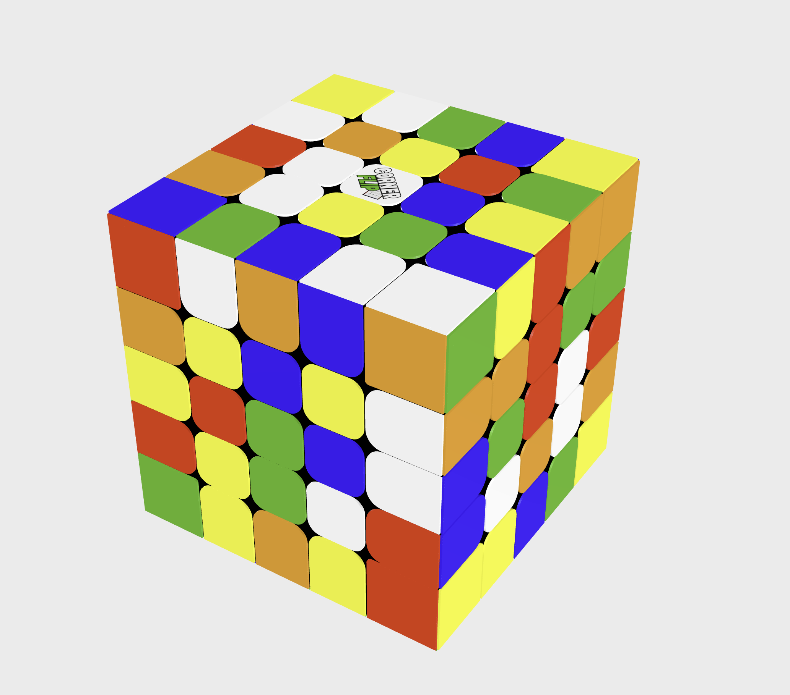

# Rubiks Cube Web Component

A Rubik's Cube web component built with Three.js and GSAP. The cube renders into a shadow‑DOM canvas and exposes a
small, promise‑based API for cube moves, rotations, reset, state setting, and camera "peek" positions. Supports 2x2,
3x3, 4x4, 5x5, 6x6, and 7x7 Rubik's cubes.

The package also ships a headless cube state class, a standalone Three.js cube object, and the underlying movement
parser, so you can use any layer of the stack on its own.



## Installation

This package is published as `@houstonp/rubiks-cube`.

```bash
bun add @houstonp/rubiks-cube
# or
npm install @houstonp/rubiks-cube
```

## Which one do I want?

The package ships five primary classes; each plays a different role.

| I want to...                                                          | Use                                          |
| --------------------------------------------------------------------- | -------------------------------------------- |
| Step through an algorithm with playback controls                      | `RubiksCubePlayer` from `/player`            |
| Drop a cube into my page with no setup                                | `RubiksCubeElement` from `/view`             |
| Add a cube to my own three.js scene                                   | `RubiksCube3D` from `/three`                 |
| Drive cube state from my own renderer / view                          | `RubiksCubeController` from `/controller`    |
| Track cube state with no rendering (solver, scrambler, headless test) | `RubiksCubeState` from `/state`              |

`RubiksCubePlayer` wraps `RubiksCubeElement` with playback UI; `RubiksCubeElement` is built on top of `RubiksCube3D`
+ `RubiksCubeController` + `RubiksCubeState`, so most users only need the first or second row.

## Package layout

The package exposes several subpath entry points so you only pull in the parts you need.

| Subpath                            | Exports                                                                                                          |
| ---------------------------------- | ---------------------------------------------------------------------------------------------------------------- |
| `@houstonp/rubiks-cube/player`     | `RubiksCubePlayer`, `RubiksCubePlayerAttributes`                                                                 |
| `@houstonp/rubiks-cube/view`       | `RubiksCubeElement`, `AttributeNames`, `PeekActions`, `PeekStates`, `AnimationStyles`                            |
| `@houstonp/rubiks-cube/three`      | `RubiksCube3D`, `RubiksCube3DSettings`                                                                           |
| `@houstonp/rubiks-cube/controller` | `RubiksCubeController`                                                                                           |
| `@houstonp/rubiks-cube/core`       | `Movements`, `Rotations`, `Faces`, `CubeTypes`, `LayerCount`, `isMovement`, `IsRotation`, `reverse`, `translate` |
| `@houstonp/rubiks-cube/state`      | `RubiksCubeState`, `Axi`, `GetMovementSlice`, `GetRotationSlice`                                                 |

There is no bare-package root export — every class lives on a subpath that names its layer.

## Adding the component

Register the custom element and then use the tag in your HTML.

```js
// index.js
import { RubiksCubeElement } from '@houstonp/rubiks-cube/view';

// Registers <rubiks-cube> (you can pass a different tag name if you prefer)
RubiksCubeElement.register();
```

```html
<!DOCTYPE html>
<html lang="en">
    <head>
        <meta charset="utf-8" />
        <title>Rubiks Cube Demo</title>
    </head>
    <body>
        <!-- Create a 3x3 cube with custom settings -->
        <rubiks-cube cube-type="Three" animation-speed-ms="1000" animation-style="exponential" piece-gap="1.04" camera-speed-ms="100"></rubiks-cube>

        <!-- Or create a 2x2 cube -->
        <rubiks-cube cube-type="Two"></rubiks-cube>

        <!-- Or create a 7x7 cube -->
        <rubiks-cube cube-type="Seven"></rubiks-cube>

        <script type="module" src="index.js"></script>
    </body>
</html>
```

## Component attributes

These attributes control animation, spacing, camera behavior, and cube type. The available attributes can be imported
so that they can be get and set easily.

```js
import { RubiksCubeElement, AttributeNames } from '@houstonp/rubiks-cube/view';
import { CubeTypes, AnimationStyles } from '@houstonp/rubiks-cube/core';

const cube = document.querySelector('rubiks-cube');

// Get an attribute value
const animationSpeed = cube.getAttribute(AttributeNames.animationSpeed);
console.log('Current animation speed:', animationSpeed);

// Set an attribute value
cube.setAttribute(AttributeNames.animationSpeed, '500');
cube.setAttribute(AttributeNames.cubeType, CubeTypes.Four); // Change to 4x4 cube
cube.setAttribute(AttributeNames.animationStyle, AnimationStyles.Exponential);
cube.setAttribute(AttributeNames.pieceGap, '1.05');
cube.setAttribute(AttributeNames.cameraRadius, '6');
cube.setAttribute(AttributeNames.cameraFieldOfView, '80');
cube.setAttribute(AttributeNames.cameraPeekAngleHorizontal, '0.7');
cube.setAttribute(AttributeNames.cameraPeekAngleVertical, '0.7');
```

| attribute                    | accepted values                                             | Description                                                                                                                                                                                       |
| ---------------------------- | ----------------------------------------------------------- | ------------------------------------------------------------------------------------------------------------------------------------------------------------------------------------------------- |
| cube-type                    | `"Two"`, `"Three"`, `"Four"`, `"Five"`, `"Six"`, `"Seven"`  | Sets the cube size (2x2 through 7x7). Default is `"Three"`                                                                                                                                        |
| animation-speed-ms           | number greater than or equal to 0                           | Sets the duration of cube animations in milliseconds. Default is `100`                                                                                                                            |
| animation-style              | `"exponential"`, `"linear"`, `"next"`, `"fixed"`, `"match"` | `fixed`: fixed animation lengths, `next`: skips to next animation, `linear`: ramps speed linearly with backlog, `exponential`: speeds up successive animations, `match`: matches event frequency. |
| piece-gap                    | number between 1 and 1.1                                    | Sets the gap between Rubik's Cube pieces. Default is `1.04`                                                                                                                                       |
| camera-speed-ms              | number greater than or equal to 0                           | Sets the duration of camera animations in milliseconds. Default is `100`                                                                                                                          |
| camera-radius                | number greater than or equal to 4                           | Sets the camera radius. Default is `5`                                                                                                                                                            |
| camera-peek-angle-horizontal | decimal between 0 and 1                                     | Sets the horizontal peek angle. Default is `0.6`                                                                                                                                                  |
| camera-peek-angle-vertical   | decimal between 0 and 1                                     | Sets the vertical peek angle. Default is `0.6`                                                                                                                                                    |
| camera-field-of-view         | integer between 30 and 100                                  | Sets the field of view of the camera. Default is `75`                                                                                                                                             |

## Programmatic control

The `RubiksCubeElement` instance exposes the methods below. `move`, `rotate`, and `peek` are async and resolve once the
animation completes; `reset`, `setState`, `getState`, and `setType` are synchronous and apply to the cube immediately.

### Move

Performs a cube movement and resolves with the new state string.

```ts
move(move: Movement, options?: AnimationOptions): Promise<string>
```

```js
import { RubiksCubeElement } from '@houstonp/rubiks-cube/view';
import { Movements } from '@houstonp/rubiks-cube/core';

const cube = document.querySelector('rubiks-cube');

// Single layer moves
await cube.move(Movements.Single.R); // Right face clockwise
await cube.move(Movements.Single.R2); // Right face 180 degrees
await cube.move(Movements.Single.RP); // Right face counter-clockwise
await cube.move(Movements.Single.U); // Upper face clockwise
await cube.move(Movements.Single.FP); // Front face counter-clockwise

// Wide moves
await cube.move(Movements.Wide.Rw); // Right two layers (Rw)
await cube.move(Movements.Wide.r); // Right two layers (r)

// Layer-specific moves (for 4x4+ cubes)
await cube.move(Movements.Two.R); // Second layer right
await cube.move(Movements.Three.R); // Third layer right (for 4x4+)
await cube.move(Movements.Four.R); // Fourth layer right (for 5x5+)

// Middle layer moves
await cube.move(Movements.Single.M); // Middle layer
await cube.move(Movements.Single.E); // Equatorial layer
await cube.move(Movements.Single.S); // Standing layer

// Override animation speed for a single move
await cube.move(Movements.Single.R, { animationSpeedMs: 200 });

// Reverse the move direction (R is treated as R')
await cube.move(Movements.Single.R, { reverse: true });

// Translate 3x3 notation to big cube notation (e.g. r on a 7x7 becomes 6r)
await cube.move(Movements.Wide.r, { translate: true });

// Chain multiple moves
const moves = [Movements.Single.R, Movements.Single.U, Movements.Single.RP, Movements.Single.UP];
for (const move of moves) {
    const state = await cube.move(move);
    console.log('State after', move, ':', state);
}
```

### Rotate

Rotates the entire cube and resolves with the new state string.

```ts
rotate(rotation: Rotation, options?: AnimationOptions): Promise<string>
```

```js
import { RubiksCubeElement } from '@houstonp/rubiks-cube/view';
import { Rotations } from '@houstonp/rubiks-cube/core';

const cube = document.querySelector('rubiks-cube');

// Rotate cube on x-axis (like R move)
await cube.rotate(Rotations.x); // 90 degrees clockwise
await cube.rotate(Rotations.x2); // 180 degrees
await cube.rotate(Rotations.xP); // 90 degrees counter-clockwise

// Rotate cube on y-axis (like U move)
await cube.rotate(Rotations.y); // 90 degrees clockwise
await cube.rotate(Rotations.y2); // 180 degrees
await cube.rotate(Rotations.yP); // 90 degrees counter-clockwise

// Rotate cube on z-axis (like F move)
await cube.rotate(Rotations.z); // 90 degrees clockwise
await cube.rotate(Rotations.z2); // 180 degrees
await cube.rotate(Rotations.zP); // 90 degrees counter-clockwise

// Override animation speed for a single rotation
await cube.rotate(Rotations.y, { animationSpeedMs: 600 });

// Reverse rotation direction (y is treated as y')
await cube.rotate(Rotations.y, { reverse: true });
```

### Reset

Resets the cube to the solved state and returns the new state string. Any in‑flight animation is snapped to its end
position before the reset is applied.

```ts
reset(): string
```

```js
import { RubiksCubeElement } from '@houstonp/rubiks-cube/view';
import { Movements } from '@houstonp/rubiks-cube/core';

const cube = document.querySelector('rubiks-cube');

// Reset to solved state
const solvedState = cube.reset();
console.log('Cube reset to solved state:', solvedState);

// Reset after performing some moves
await cube.move(Movements.Single.R);
await cube.move(Movements.Single.U);
const resetState = cube.reset();
```

### SetState / GetState

Sets the cube to a specific state using a Kociemba‑format state string, or reads the current state. `setState` returns
`true` on success and `false` if the input string is not valid for any supported cube type.

```ts
setState(kociembaState: string): boolean
getState(): string
```

```js
import { RubiksCubeElement } from '@houstonp/rubiks-cube/view';
import { Movements } from '@houstonp/rubiks-cube/core';

const cube = document.querySelector('rubiks-cube');

// Save current state
await cube.move(Movements.Single.R);
const currentState = cube.getState();

// Later, restore that state
const ok = cube.setState(currentState);
if (!ok) {
    console.error('Failed to set state — string did not match a supported cube size');
}

// Set a specific scrambled state (example for 3x3)
const scrambledState = 'UULUUFUUFRRUBRRURRFFDFFUFFFDDRDDDDDDBLLLLLLLLBRRBBBBBB';
cube.setState(scrambledState);
```

### SetType

Switches the cube to a different size at runtime by reflecting the value to the `cube-type` attribute, which
triggers an internal rebuild. Returns the cube's state string after the call. If the new type matches the
current type, `setType` is a no-op and returns the current state — call `reset()` if you also want to clear
the cube to solved.

```ts
setType(cubeType: CubeType): string
```

```js
import { RubiksCubeElement } from '@houstonp/rubiks-cube/view';
import { CubeTypes } from '@houstonp/rubiks-cube/core';

const cube = document.querySelector('rubiks-cube');

const newState = cube.setType(CubeTypes.Five); // Rebuild as a 5x5; returns the solved 5x5 state
cube.setType(CubeTypes.Five);                  // No-op; returns whatever the current state is
```

Setting the `cube-type` attribute directly (`cube.setAttribute('cube-type', 'Five')`) is equivalent to calling
`setType`, since both go through the same attribute-change path.

### Peek

Animates the camera to a new "peek" position and resolves with the new peek state.

```ts
peek(action: PeekAction, options?: CameraOptions | null): Promise<PeekState>
```

The camera tracks **two independent boolean axes** — horizontal (Right / Left) and vertical (Up / Down) — giving
**four reachable positions** (the `PeekState`s: `RightUp`, `RightDown`, `LeftUp`, `LeftDown`). The 10 `PeekAction`
values are inputs that operate on this state machine, in three categories:

| Category               | Actions                                        | Effect                                                       |
| ---------------------- | ---------------------------------------------- | ------------------------------------------------------------ |
| Set both axes          | `RightUp`, `RightDown`, `LeftUp`, `LeftDown`   | Move directly to that position                               |
| Set one axis           | `Right`, `Left`, `Up`, `Down`                  | Set that axis only; the other axis keeps its current value   |
| Toggle one axis        | `Horizontal`, `Vertical`                       | Flip that axis relative to its current value                 |

Because the second and third categories only affect one axis, the result of e.g. `peek(Up)` depends on the prior
peek state. The promise always resolves with the new full `PeekState`.

```js
import { RubiksCubeElement, PeekActions, PeekStates } from '@houstonp/rubiks-cube/view';

const cube = document.querySelector('rubiks-cube');

// Move directly to a position (sets both axes)
await cube.peek(PeekActions.RightUp); // → PeekStates.RightUp
await cube.peek(PeekActions.LeftDown); // → PeekStates.LeftDown

// Set one axis, leave the other untouched
await cube.peek(PeekActions.Right); // sets horizontal to Right; vertical unchanged
await cube.peek(PeekActions.Up);    // sets vertical to Up; horizontal unchanged

// Toggle one axis relative to its current value
await cube.peek(PeekActions.Horizontal); // flips horizontal
await cube.peek(PeekActions.Vertical);   // flips vertical

// The promise resolves with the new full peek state
const peekState = await cube.peek(PeekActions.RightUp);
console.log('Current peek state:', peekState); // 'rightUp'

// Override camera animation speed for a single peek
await cube.peek(PeekActions.Left, { cameraSpeedMs: 150 });
```

### Options

`AnimationOptions` can be passed to `move` and `rotate` to customise individual operations, taking precedence over the
corresponding element attributes.

| Option             | Type      | Description                                                                                                        |
| ------------------ | --------- | ------------------------------------------------------------------------------------------------------------------ |
| `animationSpeedMs` | `number`  | Duration of the animation in milliseconds. Overrides the `animation-speed-ms` attribute for this call only.        |
| `reverse`          | `boolean` | Reverses the direction of the move or rotation (e.g. `R` is treated as `R'`).                                      |
| `translate`        | `boolean` | Translates 3x3 notation to the equivalent big-cube notation (e.g. `r` on a 7x7 is treated as `6r`). Movement only. |

`CameraOptions` can be passed to `peek` to customise the camera animation.

| Option          | Type     | Description                                                                                                     |
| --------------- | -------- | --------------------------------------------------------------------------------------------------------------- |
| `cameraSpeedMs` | `number` | Duration of the camera animation in milliseconds. Overrides the `camera-speed-ms` attribute for this call only. |

### Complete Example

```js
import { RubiksCubeElement, AttributeNames, PeekActions } from '@houstonp/rubiks-cube/view';
import { Movements, Rotations, CubeTypes, AnimationStyles } from '@houstonp/rubiks-cube/core';

RubiksCubeElement.register();

const cube = document.querySelector('rubiks-cube');

// Configure cube settings
cube.setAttribute(AttributeNames.cubeType, CubeTypes.Four); // Use 4x4 cube
cube.setAttribute(AttributeNames.animationSpeed, '800');
cube.setAttribute(AttributeNames.animationStyle, AnimationStyles.Exponential);

// Perform a sequence of moves
await cube.move(Movements.Single.R);
await cube.move(Movements.Single.U);
await cube.rotate(Rotations.y);
await cube.move(Movements.Wide.Rw);

// Peek to see a different angle
await cube.peek(PeekActions.RightUp);

// Save the current state
await cube.move(Movements.Single.F);
const currentState = cube.getState();

// Reset and restore
cube.reset();
cube.setState(currentState);
```

## Algorithm player

`RubiksCubePlayer` is a higher-level web component that wraps `RubiksCubeElement` with playback controls for
stepping through an algorithm. You provide a setup scramble and an algorithm, and the player applies the setup to
the cube and exposes start / rewind / step-back / stop / step-forward / play / end buttons that walk through the
algorithm one move at a time.

```js
import { RubiksCubePlayer } from '@houstonp/rubiks-cube/player';

// Registers <rubiks-cube-player> (you can pass a different tag name if you prefer)
RubiksCubePlayer.register();
```

```html
<!-- Setup scrambles the cube; alg is the algorithm the controls play through -->
<rubiks-cube-player
    cubeType="Three"
    setup="R U R' U R U2 R'"
    alg="R U R' U' R' F R2 U' R' U' R U R' F'"
    style="display: block; width: 400px; height: 400px;"
></rubiks-cube-player>
```

The host needs an explicit size (or a sized parent), since the inner cube canvas measures itself from the host's
client dimensions.

### Player attributes

| attribute | accepted values                                            | Description                                                                            |
| --------- | ---------------------------------------------------------- | -------------------------------------------------------------------------------------- |
| cubeType  | `"Two"`, `"Three"`, `"Four"`, `"Five"`, `"Six"`, `"Seven"` | Sets the cube size (2x2 through 7x7). Default is `"Three"`                             |
| setup     | space-separated notation                                   | Scramble applied to the cube before playback. The "jump to start" button returns here. |
| alg       | space-separated notation                                   | The algorithm the playback controls walk through, one token at a time.                 |

`setup` and `alg` accept any whitespace-separated sequence of `Movement` or `Rotation` tokens. Unrecognised tokens
and `// line comments` are stripped before parsing.

### Playback methods

The same actions the buttons trigger are available programmatically.

| Method            | Description                                                                                |
| ----------------- | ------------------------------------------------------------------------------------------ |
| `stepForward()`   | Apply the next move in `alg`. Stops any in-progress play loop.                             |
| `stepBackward()`  | Reverse the previous move in `alg`. Stops any in-progress play loop.                       |
| `playForward()`   | Walk forward through `alg` until it ends or `stop()` is called.                            |
| `playBackward()`  | Walk backward through `alg` until the start of the algorithm is reached or `stop()` is called. |
| `stop()`          | Halt any active play loop after the in-flight animation resolves.                          |
| `jumpToStart()`   | Snap the cube to the post-`setup` state without animation.                                 |
| `jumpToEnd()`     | Snap the cube to the post-`alg` state without animation.                                   |

`playForward` and `playBackward` are async and resolve once the loop exits. Step methods resolve once the single
animation completes. The cube's `animation-speed-ms` attribute controls per-move pacing — set it on the inner
`<rubiks-cube>` (or forward it through the player host) to slow playback down.

## Headless cube state

If you don't need rendering you can drive the cube state directly with `RubiksCubeState`. It tracks the cube using
the same parser as the web component and exposes both raw sticker state and Kociemba string helpers.

```js
import { RubiksCubeState } from '@houstonp/rubiks-cube/state';
import { CubeTypes, Movements, Rotations } from '@houstonp/rubiks-cube/core';

const cube = new RubiksCubeState(CubeTypes.Three);

cube.move(Movements.Single.R);
cube.rotate(Rotations.y);

// Apply a sequence in one call
cube.do([Movements.Single.R, Movements.Single.U, Movements.Single.RP, Movements.Single.UP]);

// Read the current state as a Kociemba string
const kociemba = cube.getKociemba();
console.log(kociemba);

// Restore from a Kociemba string
const restored = new RubiksCubeState(CubeTypes.Three);
const ok = restored.setKociemba(kociemba); // false if the string is not valid for this cube size
```

`getState()` / `setState()` round‑trip the raw sticker array if you want to skip the Kociemba encoding. For
lower‑level access to slices, the same subpath also exports `GetMovementSlice`, `GetRotationSlice`, and the `Axi`
enum.

## Standalone 3D object

`RubiksCube3D` is a `THREE.Object3D` you can drop into your own scene. The web component uses it internally; you can
use it directly when you want full control over the renderer, camera, and animation loop.

```js
import { RubiksCube3D, RubiksCube3DSettings } from '@houstonp/rubiks-cube/three';
import { CubeTypes, Movements } from '@houstonp/rubiks-cube/core';
import { GetMovementSlice } from '@houstonp/rubiks-cube/state';
import { Scene, PerspectiveCamera, WebGLRenderer } from 'three';

const settings = new RubiksCube3DSettings({
    cubeType: CubeTypes.Three,
    pieceGap: 1.04,
    animationSpeedMs: 150,
    animationStyle: 'sine',
});
const cube = new RubiksCube3D(settings);
// or, if the defaults are fine:
// const cube = new RubiksCube3D(new RubiksCube3DSettings());

const scene = new Scene();
scene.add(cube);

// Drive a slice manually
const slice = GetMovementSlice(Movements.Single.R, 3);
await cube.slice(slice, { animationSpeedMs: 200, ease: 'sine.inOut' });
```

The `animationStyle` argument accepts any GSAP ease (string or function), since each slice is animated by GSAP under the
hood.

If you want the higher‑level "movement / rotation" API but with a custom 3D view, import `RubiksCubeController`
from `@houstonp/rubiks-cube/controller`. It composes a `RubiksCubeState` with any object implementing the small
`RubiksCubeViewInterface` (`slice`, `setState`, `reset`).

## Rubiks Cube Notation

Notations can include the number of rotations of a face. For example, `U2` means rotate the upper face 180 degrees.

Notations can also include a prime symbol `'` to indicate a counter‑clockwise rotation. For example, `U'` means rotate
the upper face counter‑clockwise. The direction is always determined relative to the face being moved.

Notations can also include a layer identifier for larger cubes. For example `3R2'` means rotate the third layer from the
right face counter‑clockwise twice.

When both a number and a prime symbol are included, the number is stated before the prime symbol. For example, `U2'`
means rotate the upper face 180 degrees counter‑clockwise, and `U'2` is invalid.

Valid notation constants are available via the `core` export. Use these constants instead of string literals for better
type safety and autocomplete support.

Duplicate or equivalent notations are not provided in the `core` export. For example `R3` and `R'` are equivalent and
only `R'` is provided in the export.

```js
import { RubiksCubeElement, AttributeNames, PeekActions } from '@houstonp/rubiks-cube/view';
import { Rotations, Movements, CubeTypes, AnimationStyles } from '@houstonp/rubiks-cube/core';

const cube = document.querySelector('rubiks-cube');

// Use constants for moves
cube.move(Movements.Single.R);
cube.move(Movements.Single.U2);
cube.move(Movements.Single.FP);

// Use constants for rotations
cube.rotate(Rotations.x);
cube.rotate(Rotations.y2);
cube.rotate(Rotations.zP);

// Use constants for peek actions
cube.peek(PeekActions.Right);
cube.peek(PeekActions.RightUp);

// Use constants for cube types
cube.setAttribute(AttributeNames.cubeType, CubeTypes.Four);

// Use constants for animation styles
cube.setAttribute(AttributeNames.animationStyle, AnimationStyles.Exponential);
```

Notation must match the following Regex

`/([1234567]|[123456]-[1234567])?([RLUDFB]w|[RLUDFBMES]|[rludfbmes])([123])?(\')?$/`

Some notation may not work as intended as there is no known interpretation. e.g. `2M`.

Standard Notation

| Notation | Movement                                   |
| -------- | ------------------------------------------ |
| U        | Top face clockwise                         |
| u        | Top two layers clockwise                   |
| D        | Bottom face clockwise                      |
| d        | Bottom two layers clockwise                |
| L        | Left face clockwise                        |
| l        | Left two layers clockwise                  |
| R        | Right face clockwise                       |
| r        | Right two layers clockwise                 |
| F        | Front face clockwise                       |
| f        | Front two layers clockwise                 |
| B        | Back face clockwise                        |
| b        | Back two layers clockwise                  |
| M        | Middle layer clockwise (relative to L)     |
| E        | Equatorial layer clockwise (relative to D) |
| S        | Standing layer clockwise (relative to F)   |

Big Cube Notation. Not all listed for brevity.

| Notation | Movement                                        |
| -------- | ----------------------------------------------- |
| NR       | Nth right‑most layer                            |
| NRw      | All right layers up to the Nth right‑most layer |
| Nr       | All right layers up to the Nth right‑most layer |
| X-YRw    | Layers X through Y from the right face          |

Range moves (`X-YRw`) apply to **wide moves**, **single face moves** (`R`, `L`, `U`, `D`, `F`, `B`), and **slice
moves** (`M`, `E`, `S`). The `Movements.Range` builder validates the inputs at the call site and returns a
typed string:

```js
import { Movements } from '@houstonp/rubiks-cube/core';

// Wide moves
await cube.move(Movements.Range(2, 4, Movements.Wide.Rw));   // → '2-4Rw'
await cube.move(Movements.Range(3, 5, Movements.Wide.r));    // → '3-5r'
await cube.move(Movements.Range(2, 4, Movements.Wide.RwP));  // → "2-4Rw'"

// Single face moves
await cube.move(Movements.Range(2, 4, Movements.Single.R));  // → '2-4R'
await cube.move(Movements.Range(2, 3, Movements.Single.LP)); // → "2-3L'"

// Slice moves
await cube.move(Movements.Range(2, 4, Movements.Single.M));  // → '2-4M'
await cube.move(Movements.Range(2, 3, Movements.Single.SP)); // → "2-3S'"
```

`Movements.Range` throws if `lower < 1`, `lower >= upper`, `upper > 7`, or the base move has an existing layer
prefix (e.g. `2R`, `2-4Rw`). It does not check the range against the current cube size — passing
`Range(2, 6, ...)` to a 4x4 produces a string that the parser will reject at `move()` time.

Rotation Notation

| Notation | Rotation                                         |
| -------- | ------------------------------------------------ |
| x        | Rotate cube on x axis clockwise (direction of R) |
| y        | Rotate cube on y axis clockwise (direction of U) |
| z        | Rotate cube on z axis clockwise (direction of F) |

These symbols align with the movements and rotations accepted by the component's API.

## Development

This repository is set up as an npm package and uses **Bun** for scripts and type generation.

- **Install dependencies**

    ```bash
    bun install
    ```

- **Run Tests**

    ```bash
    bun run test
    ```

- **Generate TypeScript declaration files**

    ```bash
    bun run build:types
    ```

The generated `.d.ts` files are emitted into the `types/` directory (ignored in git) and are used for consumers of the
package. There is currently no dedicated demo app in this repository; you can import the component into your own app
(e.g., Vite, Next.js, or any ES‑module‑aware bundler) to experiment locally.
